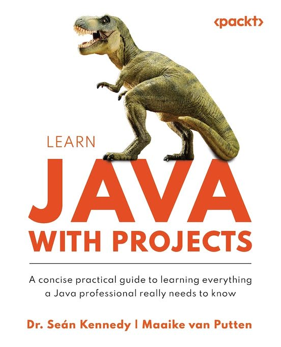

# Exercise 5 👩‍⚕️
___
If a dinosaur’s health score falls below a certain critical value, the program should throw a
custom exception, named CriticalHealthException. Create this custom exception
and use it in your program to handle this specific problematic condition
<br />
___
### Below is a successful run:
```
2024-10-12T03:05:58.538519Z: Health status for Judas: EXCELLENT
2024-10-12T03:05:58.675687Z: Health status for Judas: EXCELLENT
2024-10-12T03:05:58.780296Z: Health status for Judas: EXCELLENT
        .
        .
        .
  4 seconds later
        .
        .
        .
2024-10-12T03:06:02.989877Z: Health status for Judas: GOOD
2024-10-12T03:06:03.090912Z: Health status for Judas: GOOD
2024-10-12T03:06:03.191874Z: Health status for Judas: EXCELLENT
2024-10-12T03:06:03.293010Z: Health status for Judas: EXCELLENT
2024-10-12T03:06:03.397611Z: Health status for Judas: EXCELLENT
2024-10-12T03:06:03.499785Z: Health status for Judas: EXCELLENT
```

### Below we have to save Judas' life 😲
```
2024-10-12T03:19:56.978751Z: Health status for Judas: EXCELLENT
2024-10-12T03:19:57.125388Z: Health status for Judas: EXCELLENT
2024-10-12T03:19:57.225663Z: Health status for Judas: GOOD
2024-10-12T03:19:57.331290Z: Health status for Judas: GOOD
2024-10-12T03:19:57.431619Z: Health status for Judas: EXCELLENT
2024-10-12T03:19:57.532690Z: Health status for Judas: GOOD
2024-10-12T03:19:57.633731Z: Health status for Judas: SUBPAR
2024-10-12T03:19:57.734999Z: Health status for Judas: CRITICAL
CRITICAL HEALTH: PERFORMING EMERGENCY TREATMENT
Judas is all better! Health: EXCELLENT
```
___
<br /><br />
