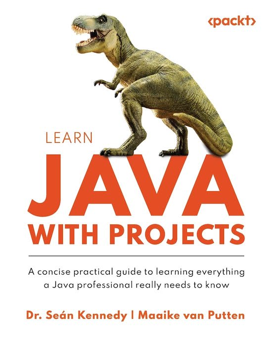

# 🚀 Exceptions with Java

Welcome to **Exceptions With Java**! 🎉

In this project, we dive deep into the exciting world of Java exceptions through hands-on exercises from *Learn Java With Projects* by Dr. Sean Kennedy & Maaike van Putten. Get ready to enhance your error-handling skills while building robust Java applications!

## 📚 What You'll Learn

This project focuses on implementing **exception handling** to create more resilient and maintainable Java code. From common exceptions to custom ones, you'll cover it all!

Some of the key topics include:
- **Try-Catch Blocks**: Handling exceptions like a pro 🛠️
- **Throwing Exceptions**: Intentionally raising errors when things go wrong 💥
- **Custom Exceptions**: Crafting your own exceptions for more descriptive error handling ✍️
- **Checked vs Unchecked Exceptions**: Knowing the difference is key 🔑

## 📘 About the Book

We’re using examples from the awesome book *Learn Java With Projects* by Dr. Sean Kennedy & Maaike Van Putten, which provides a hands-on approach to mastering Java by building real-world projects. This chapter focuses specifically on **exceptions** to help you understand how to manage and anticipate errors in your code effectively.

### Click [here](https://www.amazon.com/Learn-Java-Projects-everything-professional/dp/1837637180/ref=sr_1_1?crid=3H4JZKY6GSSX5&dib=eyJ2IjoiMSJ9.NrwQgmtjgVJXroYFKOuEKjmk4Q-KoFCM1dDGN9_AWQlhCwpPVDSJfS1fK8rxlxfq0ZzEBMAle1QFyERxjULdWdAuIqqvm4HafGtNNmQBcN9dDwRmOg5MxnsgOyZZeLw4EJhFvCnTp_ih1aEr6U6tQhYcGYK0B3QkxeUvt2Y5pFTmdQq6JtXOTf8H-QzEcXsdWDX4KbdakHj3R1WcXD2CS39iEv37bQRChWt7vYnqw3k.GQTRcup1lc4OJj7VvU19rU4nHU7NjBnWqEbgpTasmGs&dib_tag=se&keywords=learning+java+with+projects&qid=1728703615&sprefix=learning+java+with+projects%2Caps%2C158&sr=8-1) for Amazon Link:

 

