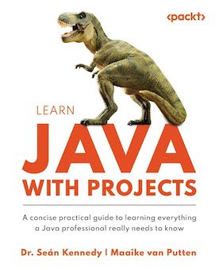

# Exercise 3 🩺
___
Even in exceptional circumstances, certain operations should always execute. For example, a
daily audit of dinosaurs’ health should happen, whether an exception occurs (for example due
to the weight being too low) or not. Use a finally block in your program to demonstrate
this. Code the logic so that even if there is an error in updating a dinosaur’s health record, a
message about the daily audit completion should still be printed.
___
  
